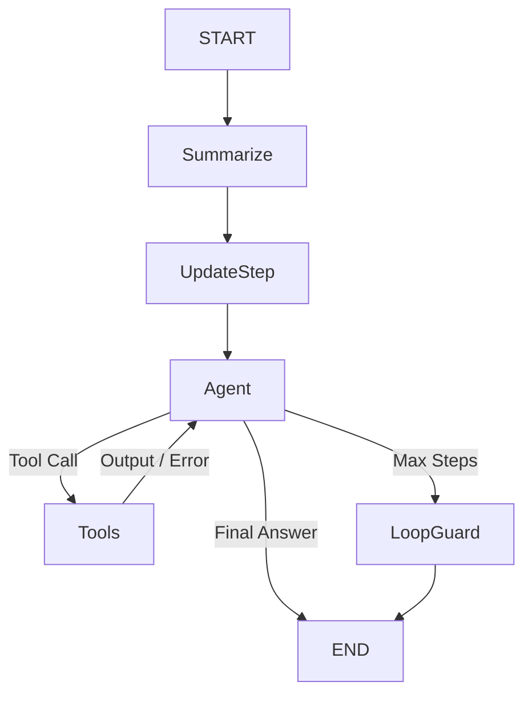

# 🤖 Autonomous AI Agent (LangGraph + MCP + Rich UI)

**v7.3b (Resilient CLI & Simplified Core)**

Продвинутый автономный **AI-агент** на базе **LangGraph** и **Model Context Protocol (MCP)**.
Агент использует детерминированную архитектуру состояний для предотвращения галлюцинаций и бесконечных циклов. Логика, безопасность и инструменты полностью модульны.

---

## ✨ Ключевые возможности

### 🧠 Simplified Core (Архитектура)
- **Linear-Cyclic Flow:** Агент использует простую и надежную схему `Start -> Summarize -> Agent <-> Tools`. Это исключает "застревание" в промежуточных узлах проверки.
- **Native LLM Judgment:** Вместо жестких программных фильтров, агент полагается на инструкции промпта и собственный здравый смысл модели.
- **Self-Correction:** При ошибке инструмента агент получает понятное сообщение (`System Hint`) и может самостоятельно исправить аргументы в следующем шаге.
- **Unified Error Contract:** Все инструменты возвращают ошибки с префиксом `Error:`, что позволяет модели четко отличать успех от провала.

### 🛡️ Безопасность и Стабильность
- **Tool Sanitizer:** Все аргументы инструментов (пути, URL, имена) автоматически очищаются и нормализуются. Защита от Path Traversal, исправление слешей, удаление лишних кавычек.
- **Robust Process Management:** Инструменты управления процессами поддерживают "Kill Tree" (рекурсивное завершение), идемпотентны (не падают, если процесс уже мертв) и имеют кросс-платформенные фоллбеки.
- **Absolute Logging:** Логи гарантированно пишутся в абсолютный путь проекта, независимо от точки запуска скрипта.
- **Loop Guard:** Жесткая защита от зацикливания и дублирования действий.

### 🔌 Инструменты
- **Smart Replace:** Кастомный инструмент для надежного редактирования кода. Автоматически обрабатывает различия в переносах строк (LF/CRLF).
- **System Diagnostics:** Нативные инструменты: IP, Geolocation, CPU/RAM stats, Local Network analysis, Find Process by Port.
- **Long-Term Memory:** Инструменты памяти (`remember_fact`, `recall_facts`, `forget_fact`) доступны в Exploration.
- **MCP Native:** Поддержка внешних серверов Model Context Protocol (например, Filesystem).
- **Media Tools:** Интеграция с `yt-dlp` для скачивания видео/аудио. Включается флагом `ENABLE_MEDIA_TOOLS`. Поддерживает выбор разрешения и извлечение аудио (mp3).
- **Smart Search:** Групповой поиск (`batch_web_search`) для экономии токенов. Поисковые инструменты можно включать/выключать через `ENABLE_SEARCH_TOOLS` в `.env`. Глубокий поиск управляется флагом `DEEP_SEARCH`. Используется кэш результатов с ограниченным размером и ретраями, управляемыми флагами `MAX_RETRIES` и `RETRY_DELAY`.

### 💻 Продвинутый CLI
- **Real-time Streaming:** Потоковый вывод сообщений агента и инструментов с минимальной задержкой.
- **Token Tracking:** Гибридный подсчет токенов (Native API или локальный `tiktoken` для несовместимых провайдеров) с итоговой статистикой после каждого запроса.
- **Resilient Session:** Автоматическое восстановление сессии после прерывания (`Ctrl+C`). CLI обнаруживает разорванные вызовы инструментов и корректно "закрывает" их, позволяя продолжить диалог без перезапуска.
- **Rich UI:** Визуализация процесса "мышления", статусов инструментов и системных сообщений.
- **Help Меню:** Команда `/help` показывает список команд и доступных инструментов с краткими описаниями. Команда `/tools` — быстрый просмотр только таблицы инструментов.
- **Контекстный промпт:** Стильный Powerline-промпт отображает текущую директорию (`Agent  <cwd> ❯`), чтобы упростить навигацию.

---

## 🚀 Установка

### 1. Подготовка окружения

Требуется **Python 3.10+**.

```bash
# Создание venv
python -m venv venv

# Активация (Windows):
venv\Scripts\activate
# Активация (Linux/Mac):
source venv/bin/activate
```

### 2. Зависимости

```bash
pip install -r requirements.txt
```

### 3. Настройка `.env`

Создайте файл `.env`. Выберите **один** из вариантов настройки провайдера.
Полный пример можно взять из `env_example.txt`.

#### Вариант А: Google Gemini (Рекомендуется для старта)
```ini
# --- ВЫБОР ПРОВАЙДЕРА ---
PROVIDER=gemini

# --- GEMINI SETTINGS ---
GEMINI_API_KEY=AIzaSy...
GEMINI_MODEL=gemini-1.5-flash
# Или: gemini-1.5-pro

# --- ОБЩИЕ НАСТРОЙКИ ---
TAVILY_API_KEY=tvly-...  # Поиск (обязательно)
MAX_LOOPS=15
TEMPERATURE=0.2

# --- СУММАРИЗАЦИЯ ---
# SESSION_SIZE: Максимальное количество сообщений в истории перед сжатием.
SESSION_SIZE=30
# SUMMARY_KEEP_LAST: Сколько последних сообщений оставлять "живыми" при сжатии.
# Позволяет агенту не терять нить текущего разговора.
SUMMARY_KEEP_LAST=10

# --- ПОДСИСТЕМЫ ---
ENABLE_SEARCH_TOOLS=true
ENABLE_SYSTEM_TOOLS=true
ENABLE_MEDIA_TOOLS=false
LONG_TERM_MEMORY=false
DEEP_SEARCH=false
SAFETY_GUARD_ENABLED=true
ENABLE_TOOL_FILTERING=true
```

#### Вариант Б: OpenAI / DeepSeek / OpenRouter / Pollinations
```ini
# --- ВЫБОР ПРОВАЙДЕРА ---
PROVIDER=openai

# --- API SETTINGS ---
OPENAI_API_KEY=sk-...

# Для оригинального OpenAI:
OPENAI_BASE_URL=https://api.openai.com/v1
OPENAI_MODEL=gpt-4o

# Для DeepSeek / OpenRouter / Pollinations:
# OPENAI_BASE_URL=https://openrouter.ai/api/v1
# OPENAI_BASE_URL=https://text.pollinations.ai/openai
# OPENAI_MODEL=deepseek-r1

# --- ОБЩИЕ НАСТРОЙКИ ---
TAVILY_API_KEY=tvly-...
MAX_LOOPS=15
TEMPERATURE=0.2

# --- ПОДСИСТЕМЫ ---
ENABLE_SEARCH_TOOLS=true
ENABLE_SYSTEM_TOOLS=true
ENABLE_MEDIA_TOOLS=false
LONG_TERM_MEMORY=false
DEEP_SEARCH=false
SAFETY_GUARD_ENABLED=true
ENABLE_TOOL_FILTERING=true
```

### 4. Настройка MCP (`mcp.json`)

```json
{
  "filesystem": {
    "command": "npx",
    "args": ["-y", "@modelcontextprotocol/server-filesystem", "."],
    "transport": "stdio",
    "enabled": false
  }
}
```
---

## 📎 Справка по .env флагам

| Флаг | Тип / Значение по умолчанию | Назначение |
| :--- | :--- | :--- |
| PROVIDER | gemini / openai (по умолчанию: gemini) | Выбор провайдера LLM |
| GEMINI_API_KEY | строка (обязательно для gemini) | Ключ API Gemini |
| GEMINI_MODEL | строка (по умолчанию: gemini-1.5-flash) | Модель Gemini |
| OPENAI_API_KEY | строка (обязательно для openai) | Ключ API для OpenAI-совместимых провайдеров |
| OPENAI_BASE_URL | строка (необязательный) | Базовый URL для OpenAI-совместимых API (OpenRouter, Pollinations) |
| OPENAI_MODEL | строка (по умолчанию: gpt-4o) | Модель OpenAI/совместимых |
| TEMPERATURE | float (по умолчанию: 0.2) | Креативность/вариативность ответов |
| MAX_LOOPS | int (по умолчанию: 15) | Лимит шагов на один запрос |
| DEBUG | bool (по умолчанию: false) | Включить расширенные логи (CLI) |
| ENABLE_SEARCH_TOOLS | bool (по умолчанию: true) | Включить/выключить поисковые инструменты |
| DEEP_SEARCH | bool (по умолчанию: false) | Разрешить глубокий поиск (дороже по токенам) |
| MAX_RETRIES | int (по умолчанию: 3) | Кол-во повторов для сетевых инструментов поиска |
| RETRY_DELAY | int (по умолчанию: 2) | Задержка (сек) между ретраями для поиска |
| MODEL_SUPPORTS_TOOLS | bool (по умолчанию: true) | Указывает, поддерживает ли модель вызов инструментов |
| LONG_TERM_MEMORY | bool (по умолчанию: false) | Включить инструменты долгосрочной памяти |
| ENABLE_SYSTEM_TOOLS | bool (по умолчанию: true) | Включить системные инструменты (сеть/железо) |
| ENABLE_MEDIA_TOOLS | bool (по умолчанию: false) | Включить инструменты для скачивания медиа (yt-dlp) |
| SESSION_SIZE | int (по умолчанию: 20) | Порог длины сессии для саммари |
| SUMMARY_KEEP_LAST | int (по умолчанию: 4) | Сколько последних сообщений хранить после сжатия |
| SAFETY_GUARD_ENABLED | bool (по умолчанию: true) | Включить Quality Gate для операций записи/удаления |
| ENABLE_TOOL_FILTERING | bool (по умолчанию: true) | Включить/выключить умную фильтрацию инструментов (фазы + LLM-классификатор) |
| TAVILY_API_KEY | строка (обязательно для поиска) | Ключ API для Tavily (search/fetch/crawl) |
| PROMPT_PATH | путь (по умолчанию: ./prompt.txt) | Путь к системному промпту |

Примечания:
- ENABLE_SEARCH_TOOLS управляет загрузкой поисковых инструментов и инициализацией Tavily-клиента.
- DEEP_SEARCH включает инструмент глубокого поиска с расширенным контентом.
- MAX_RETRIES и RETRY_DELAY управляют ретраями для поисковых инструментов (Tavily).
- SESSION_SIZE и SUMMARY_KEEP_LAST управляют механизмом сжатия контекста.
- ENABLE_TOOL_FILTERING включает фазовую/LLM-фильтрацию инструментов. При `false` все инструменты доступны всегда, но `SafetyGuard` по-прежнему контролирует опасные операции записи/удаления.

## 🏃‍♂️ Запуск

```bash
python agent_cli.py
```


**Команды внутри чата:**
- `/help` — справка по командам и инструментам.
- `/tools` — быстрый список инструментов.
- `exit` / `quit` — Выход.
- `reset` / `clear` — Сброс контекста (новая сессия).
- `Alt + Enter` — Перенос строки.

---

## 📁 Структура проекта

```text
├── agent_cli.py        # 🚀 Точка входа (CLI интерфейс)
├── agent.py            # 🧠 Основной класс AgentWorkflow (сборка графа)
├── core/               # ⚙️ Ядро системы
│   ├── config.py       # Pydantic-конфигурация (загрузка .env)
│   ├── state.py        # TypedDict состояния графа (память, шаги)
│   ├── nodes.py        # Узлы графа: фильтры, рефлексия, вызов LLM
│   ├── ui_theme.py     # [v7.2b] Централизованная тема Rich UI
│   ├── logging_config.py # [v7.2b] Настройки логирования (Console/File)
│   ├── cli_utils.py    # Утилиты CLI (TokenTracker, парсинг мыслей)
│   ├── safety_guard.py # Валидация безопасности (пути, команды)
│   └── constants.py    # Системные промпты и константы
├── tools/              # 🛠️ Модульные инструменты
│   ├── tool_registry.py # Реестр, загрузчик и декораторы
│   ├── system_tools.py  # Работа с ОС (файлы, процессы)
│   ├── search_tools.py  # Поиск (Tavily, Crawl)
│   ├── media_tools.py   # Медиа (yt-dlp)
│   ├── memory_manager.py # Долгосрочная память
│   └── ...             
├── logs/               # 📂 Логи работы (agent.log)
├── requirements.txt    # Зависимости
└── .env                # Конфигурация (API ключи)
```

## 🤝 Contributing

---

## 🛠 Граф выполнения (Logic Flow)



---

## 🆕 Новое в v7.0

- **UI/UX Enhanced:**
    - **Smart Syntax Highlighting:** Улучшенная подсветка синтаксиса для Python, Go, Rust, C++, JS, JSON. Исправлено "разрывание" блоков кода при потоковом выводе.
    - **Theme Consistency:** Единая тема `ansi_dark` для всех компонентов (Markdown, Code Blocks) для корректного отображения на Windows.
    - **Sticky Bottom Input:** Поле ввода гарантированно закреплено внизу экрана. Исправлены "скачки" текста и позиционирование курсора.
    - **Optimized Rendering:** Устранено "замирание" при выводе длинных блоков текста (Rich Live Display).
- **Configuration & Stability:**
    - **Unified Config:** Все параметры (включая `TAVILY_API_KEY`) управляются через централизованный `AgentConfig` (Pydantic).
    - **Intent Classifier Fix:** Исправлена логика передачи контекста в классификатор намерений (устранены ошибки `Intent Classifier Failed`).

## 🆕 Новое в v6.x (Archive)

- **Tool Registry:** Стратегия deny-by-default для инструментов без явной метки `capability`.
- **Async Network:** Системные инструменты переведены на `httpx`.
- **Logging:** Логи пишутся в `agent.log`.
- **Summarization:** Ограничение длины сообщений при сжатии контекста.
- **CLI Stream Processor:** Выделен отдельный обработчик потока.

## 🆕 Новое в v7.2b

- **UI Refactoring:** Полная переработка пользовательского интерфейса с использованием централизованной темы (`core/ui_theme.py`).
- **Dashboard View:** Новый режим отображения "мыслей" агента в виде структурированной сетки (`Table.grid`), что устраняет скачки текста и улучшает читаемость.
- **Semantic Theming:** Переход от хардкодных цветов к семантическим стилям (например, `tool.name`, `agent.say`), что упрощает поддержку и изменение внешнего вида.
- **Improved Live Display:** Более плавные анимации и корректное отображение Markdown-блоков в реальном времени.

## 🆕 Новое в v7.1b

- Централизация путей: `BASE_DIR` вынесен в [constants.py](core/constants.py), дублирующая логика убрана из `config.py` и `agent_cli.py`. Загрузка модулей из корня теперь использует `sys.path.insert(0, BASE_DIR)` для предсказуемых импортов.
- ToolRegistry теперь определяет `capability` инструментов и предоставляет единый метод классификации; агент использует эту классификацию.
- SafetyGuard усилен: добавлены деструктивные корни действий (например, `delete`, `remove`), отключен творческий bypass для опасных операций, уточнены триггеры творчества (включая русскоязычные формулировки). Переключатель `SAFETY_GUARD_ENABLED` читается напрямую из `.env`.
- Поиск стал управляемым: добавлен флаг `ENABLE_SEARCH_TOOLS` для включения/отключения поисковых инструментов; глубокий поиск контролируется `DEEP_SEARCH`.
- Поиск стал стабильнее: унифицированы тексты ошибок; добавлены глобальный rate limit, настройки ретраев (`MAX_RETRIES`, `RETRY_DELAY`) и ограниченный in-memory кэш с автоочисткой.
- Инструменты памяти и системной диагностики переведены на ленивую инициализацию (ресурсы поднимаются только при использовании).
- CLI улучшен: добавлены команды `/help` и `/tools`; вывод ошибок инструментов теперь содержит короткие подсказки; промпт показывает текущую директорию.
