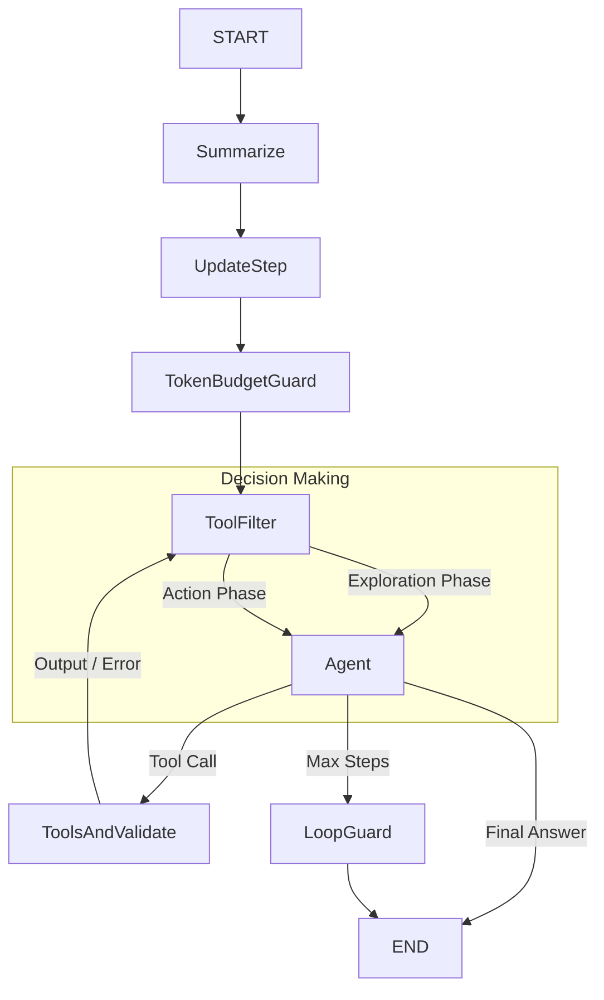

# 🤖 Autonomous AI Agent (LangGraph + MCP + Rich UI)

**v6.5b (Deterministic, Safer Tools & Logging)**

Продвинутый автономный **AI-агент** на базе **LangGraph** и **Model Context Protocol (MCP)**.
Агент использует детерминированную архитектуру состояний для предотвращения галлюцинаций и бесконечных циклов. Логика, безопасность и инструменты полностью модульны.

---

## ✨ Ключевые возможности

### 🧠 Умная Архитектура (The Brain)
- **Hybrid Tool Filter (Deterministic + LLM):** Агент работает в двух фазах:
    1.  **Exploration:** Доступны только инструменты чтения, поиска и памяти. Агент не может "сломать" файлы, пока не изучит контекст.
    2.  **Action:** Инструменты записи (`write`, `delete`) открываются только после успешного получения информации или при явном приказе пользователя.
- **Explicit Capability Metadata (централизовано):** Каждый инструмент имеет явную метку `capability` (`safe`/`write`) в `metadata`. Классификация по имени используется только как fallback для внешних MCP-инструментов; инструменты без явного `capability` трактуются как `write` по умолчанию (safety first). Агент делегирует определение возможностей реестру инструментов (ToolRegistry).
- **Intent Detection (Fast Path):** Если вы приказываете *"Создай файл"*, фильтр автоматически распознает намерение и сразу выдает права на запись, минуя фазу исследования.
- **LLM Intent Classifier:** Для сложных или неявных формулировок используется небольшой классификатор на базе LLM, который решает, является ли запрос чисто читающим (`read_only`) или изменяющим (`write_action`), с fallback на ключевые слова.
- **Config Switch:** Вся фильтрация инструментов может быть отключена флагом `ENABLE_TOOL_FILTERING=false` в `.env` — тогда агент всегда видит полный набор инструментов, а безопасность обеспечивает только `SafetyGuard`.
- **Self-Healing:** Встроенный валидатор перехватывает ошибки (например, `ENOENT`, `401`), анализирует их и заставляет агента исправить параметры без падения программы.
- **Unified Error Contract:** Все инструменты возвращают ошибки с префиксом `Error:`, что позволяет детерминированно отличать успех от провала и корректно управлять фазами фильтра.

### 🛡️ Безопасность (SafetyGuard)
- **Quality Gate:** Эвристическая защита. Если задача не творческая, агент обязан найти факты (`web_search`) и обосновать действия перед записью.
- **Destructive Actions:** Для деструктивных действий (`delete`, `remove`, `format` и т.п.) творческий обход (bypass) отключен — требуется обоснование и подтвержденные источники.
- **Loop Guard:** Жесткая защита от зацикливания и дублирования действий.

### 🔌 Инструменты
- **Smart Replace:** Кастомный инструмент для надежного редактирования кода. Автоматически обрабатывает различия в переносах строк (LF/CRLF), где обычные LLM часто ошибаются. Действует только внутри рабочей директории (защита от Path Traversal).
- **System Diagnostics:** Нативные инструменты: IP, Geolocation, CPU/RAM stats, Local Network analysis. Сетевой клиент инициализируется лениво при первом использовании и использует асинхронный `httpx` с fallback и корректным закрытием соединений.
- **Long-Term Memory:** Инструменты памяти (`remember_fact`, `recall_facts`, `forget_fact`) доступны в Exploration и считаются недеструктивными. Хранилище памяти и модель эмбеддингов создаются по требованию.
- **MCP Native:** Поддержка внешних серверов Model Context Protocol (например, Filesystem).
- **Media Tools:** Интеграция с `yt-dlp` для скачивания видео/аудио. Включается флагом `ENABLE_MEDIA_TOOLS`. Поддерживает выбор разрешения и извлечение аудио (mp3).
- **Smart Search:** Групповой поиск (`batch_web_search`) для экономии токенов. Поисковые инструменты можно включать/выключать через `ENABLE_SEARCH_TOOLS` в `.env`. Глубокий поиск управляется флагом `DEEP_SEARCH`. Используется кэш результатов с ограниченным размером и ретраями, управляемыми флагами `MAX_RETRIES` и `RETRY_DELAY`.

### 💻 Продвинутый CLI
- **Real-time Streaming:** Потоковый вывод сообщений агента и инструментов с минимальной задержкой.
- **Token Tracking:** Гибридный подсчет токенов (Native API или локальный `tiktoken` для несовместимых провайдеров) с итоговой статистикой после каждого запроса.
- **Token Budget:** Механизм защиты бюджета (`TOKEN_BUDGET`). Если лимит входных токенов исчерпан, агент блокирует дорогие операции (поиск, чтение) и фокусируется на завершении задачи с имеющимся контекстом.
- **Rich UI:** Визуализация процесса "мышления", статусов инструментов и системных сообщений (self-correction, budget alerts, quality gate).
- **Help Меню:** Команда `/help` показывает список команд и доступных инструментов с краткими описаниями. Команда `/tools` — быстрый просмотр только таблицы инструментов.
- **Контекстный промпт:** Промпт отображает текущую директорию: `User (<cwd>) >`, чтобы упростить навигацию и понимание контекста.

---

## 🚀 Установка

### 1. Подготовка окружения

Требуется **Python 3.10+**.

```bash
# Создание venv
python -m venv venv

# Активация (Windows):
venv\Scripts\activate
# Активация (Linux/Mac):
source venv/bin/activate
```

### 2. Зависимости

```bash
pip install -r requirements.txt
```

### 3. Настройка `.env`

Создайте файл `.env`. Выберите **один** из вариантов настройки провайдера.
Полный пример можно взять из `env_example.txt`.

#### Вариант А: Google Gemini (Рекомендуется для старта)
```ini
# --- ВЫБОР ПРОВАЙДЕРА ---
PROVIDER=gemini

# --- GEMINI SETTINGS ---
GEMINI_API_KEY=AIzaSy...
GEMINI_MODEL=gemini-1.5-flash
# Или: gemini-1.5-pro

# --- ОБЩИЕ НАСТРОЙКИ ---
TAVILY_API_KEY=tvly-...  # Поиск (обязательно)
MAX_LOOPS=15
TEMPERATURE=0.2
LONG_TERM_MEMORY=true
DEEP_SEARCH=false
ENABLE_SEARCH_TOOLS=true
MODEL_SUPPORTS_TOOLS=true
# Включить защиту от галлюцинаций при записи файлов?
# true - агент обязан гуглить перед записью
# false - агент может писать что угодно сразу
SAFETY_GUARD_ENABLED=false
```

#### Вариант Б: OpenAI / DeepSeek / OpenRouter / Pollinations
```ini
# --- ВЫБОР ПРОВАЙДЕРА ---
PROVIDER=openai

# --- API SETTINGS ---
OPENAI_API_KEY=sk-...

# Для оригинального OpenAI:
OPENAI_BASE_URL=https://api.openai.com/v1
OPENAI_MODEL=gpt-4o

# Для DeepSeek / OpenRouter / Pollinations:
# OPENAI_BASE_URL=https://openrouter.ai/api/v1
# OPENAI_BASE_URL=https://text.pollinations.ai/openai
# OPENAI_MODEL=deepseek-r1

# --- ОБЩИЕ НАСТРОЙКИ ---
TAVILY_API_KEY=tvly-...
MAX_LOOPS=15
TEMPERATURE=0.2
LONG_TERM_MEMORY=true
DEEP_SEARCH=false
ENABLE_SEARCH_TOOLS=true
MODEL_SUPPORTS_TOOLS=true
# Включить защиту от галлюцинаций при записи файлов?
# true - агент обязан гуглить перед записью
# false - агент может писать что угодно сразу
SAFETY_GUARD_ENABLED=false
```

### 4. Настройка MCP (`mcp.json`)

```json
{
  "filesystem": {
    "command": "npx",
    "args": ["-y", "@modelcontextprotocol/server-filesystem", "."],
    "transport": "stdio",
    "enabled": false
  }
}
```
---

## 📎 Справка по .env флагам

| Флаг | Тип / Значение по умолчанию | Назначение |
| :--- | :--- | :--- |
| PROVIDER | gemini / openai (по умолчанию: gemini) | Выбор провайдера LLM |
| GEMINI_API_KEY | строка (обязательно для gemini) | Ключ API Gemini |
| GEMINI_MODEL | строка (по умолчанию: gemini-1.5-flash) | Модель Gemini |
| OPENAI_API_KEY | строка (обязательно для openai) | Ключ API для OpenAI-совместимых провайдеров |
| OPENAI_BASE_URL | строка (необязательный) | Базовый URL для OpenAI-совместимых API (OpenRouter, Pollinations) |
| OPENAI_MODEL | строка (по умолчанию: gpt-4o) | Модель OpenAI/совместимых |
| TEMPERATURE | float (по умолчанию: 0.2) | Креативность/вариативность ответов |
| MAX_LOOPS | int (по умолчанию: 15) | Лимит шагов на один запрос |
| TOKEN_BUDGET | int (по умолчанию: 30000) | Лимит входных токенов. При превышении отключает поиск. |
| DEBUG | bool (по умолчанию: false) | Включить расширенные логи (CLI) |
| ENABLE_SEARCH_TOOLS | bool (по умолчанию: true) | Включить/выключить поисковые инструменты |
| DEEP_SEARCH | bool (по умолчанию: false) | Разрешить глубокий поиск (дороже по токенам) |
| MAX_RETRIES | int (по умолчанию: 3) | Кол-во повторов для сетевых инструментов поиска |
| RETRY_DELAY | int (по умолчанию: 2) | Задержка (сек) между ретраями для поиска |
| MODEL_SUPPORTS_TOOLS | bool (по умолчанию: true) | Указывает, поддерживает ли модель вызов инструментов |
| LONG_TERM_MEMORY | bool (по умолчанию: false) | Включить инструменты долгосрочной памяти |
| ENABLE_SYSTEM_TOOLS | bool (по умолчанию: true) | Включить системные инструменты (сеть/железо) |
| ENABLE_MEDIA_TOOLS | bool (по умолчанию: false) | Включить инструменты для скачивания медиа (yt-dlp) |
| SESSION_SIZE | int (по умолчанию: 20) | Порог длины сессии для саммари |
| SUMMARY_KEEP_LAST | int (по умолчанию: 4) | Сколько последних сообщений хранить после сжатия |
| SAFETY_GUARD_ENABLED | bool (по умолчанию: true) | Включить Quality Gate для операций записи/удаления |
| ENABLE_TOOL_FILTERING | bool (по умолчанию: true) | Включить/выключить умную фильтрацию инструментов (фазы + LLM-классификатор) |
| TAVILY_API_KEY | строка (обязательно для поиска) | Ключ API для Tavily (search/fetch/crawl) |
| PROMPT_PATH | путь (по умолчанию: ./prompt.txt) | Путь к системному промпту |

Примечания:
- ENABLE_SEARCH_TOOLS управляет загрузкой поисковых инструментов и инициализацией Tavily-клиента.
- DEEP_SEARCH включает инструмент глубокого поиска с расширенным контентом.
- MAX_RETRIES и RETRY_DELAY управляют ретраями для поисковых инструментов (Tavily).
- SESSION_SIZE и SUMMARY_KEEP_LAST управляют механизмом сжатия контекста.
- ENABLE_TOOL_FILTERING включает фазовую/LLM-фильтрацию инструментов. При `false` все инструменты доступны всегда, но `SafetyGuard` по-прежнему контролирует опасные операции записи/удаления.

## 🏃‍♂️ Запуск

```bash
python agent_cli.py
```


**Команды внутри чата:**
- `/help` — справка по командам и инструментам.
- `/tools` — быстрый список инструментов.
- `exit` / `quit` — Выход.
- `reset` / `clear` — Сброс контекста (новая сессия).
- `Alt + Enter` — Перенос строки.

---

## 📁 Структура проекта

### Корневые файлы
| Файл | Назначение |
| :--- | :--- |
| `agent.py` | **Core Flow.** Граф выполнения, фильтрация инструментов, валидация. |
| `agent_cli.py` | **UI.** Точка входа, обработка ввода/вывода, спиннеры. |
| `prompt.txt` | Системный промпт (по умолчанию). |
| `mcp.json` | Конфигурация MCP-серверов. |
| `env_example.txt` | Пример `.env` со всеми актуальными флагами. |
| `requirements.txt` | Python-зависимости. |
| `win-cli-config.json` | Настройки Windows CLI/сборки (если используются). |

### Модули `core/` (Ядро)
| Файл | Назначение |
| :--- | :--- |
| `state.py` | Состояние графа (включая `allowed_tools`). |
| `config.py` | Настройки Pydantic, выбор LLM. |
| `logging_config.py` | Настройка логирования (handlers/формат). |
| `safety_guard.py` | Политики безопасности (Quality Gate). |
| `tool_validator.py` | Логика проверки ошибок инструментов. |
| `tool_sanitizer.py` | Очистка аргументов и путей. |
| `utils.py` | Подсчет токенов. |
| `constants.py` | Централизованное определение `BASE_DIR` для путей и `.env`. |

### Модули `tools/` (Инструменты)
| Файл | Назначение |
| :--- | :--- |
| `tool_registry.py` | Загрузчик и классификатор инструментов (централизует `capability` и fallback-эвристику). |
| `patch_tool.py` | **Smart Replace** (надежное редактирование). |
| `system_tools.py` | Диагностика системы и сети. |
| `search_tools.py` | Поиск в интернете (Tavily). |
| `delete_tools.py` | Безопасное удаление. |
| `memory_manager.py` | Долгосрочная память (remember/recall/forget). |

### Директория `dist/` (опционально)
| Папка/файл | Назначение |
| :--- | :--- |
| `dist/` | Артефакты сборки (например, `.exe`) и вспомогательные файлы. |

---

## 🛠 Граф выполнения (Logic Flow)



---

## 🆕 Новое в v6.3b

- Усилен реестр инструментов: эвристика `ToolRegistry.get_tool_capability` теперь использует стратегию deny-by-default — инструменты без явной метки `capability` считаются `write` и попадают под более строгие политики безопасности.
- Системные сетевые инструменты (`system_tools.py`) переведены на асинхронный клиент на базе `httpx` вместо блокирующего `requests`, что улучшает масштабируемость и поведение под нагрузкой.
- Логирование по умолчанию пишет в файл `agent.log` в корне проекта (через `core/logging_config.py`), при этом сохраняется красивый вывод в консоль.
- Загрузка системного промпта из `prompt.txt` теперь логируется: путь к файлу, длина текста и fallback-сценарий при отсутствии файла; это упрощает диагностику проблем с промптом.
- Механизм суммаризации истории ограничивает длину отдельных сообщений перед отправкой в LLM, что снижает расход токенов и защищает от переполнения контекста при длинных сессиях.
- Переработан CLI (`agent_cli.py`): вынесен отдельный потоковый обработчик (`StreamProcessor`) с визуализацией мыслей агента, вызовов инструментов и итоговой статистики по токенам.

## 🆕 Новое в v6.1b

- Централизация путей: `BASE_DIR` вынесен в [constants.py](file:///d:/py_projects/simple_ai_agent/agent+stategraph/v6.3b/core/constants.py), дублирующая логика убрана из `config.py` и `agent_cli.py`. Загрузка модулей из корня теперь использует `sys.path.insert(0, BASE_DIR)` для предсказуемых импортов.
- ToolRegistry теперь определяет `capability` инструментов и предоставляет единый метод классификации; агент использует эту классификацию.
- SafetyGuard усилен: добавлены деструктивные корни действий (например, `delete`, `remove`), отключен творческий bypass для опасных операций, уточнены триггеры творчества (включая русскоязычные формулировки). Переключатель `SAFETY_GUARD_ENABLED` читается напрямую из `.env`.
- Поиск стал управляемым: добавлен флаг `ENABLE_SEARCH_TOOLS` для включения/отключения поисковых инструментов; глубокий поиск контролируется `DEEP_SEARCH`.
- Поиск стал стабильнее: унифицированы тексты ошибок; добавлены глобальный rate limit, настройки ретраев (`MAX_RETRIES`, `RETRY_DELAY`) и ограниченный in-memory кэш с автоочисткой.
- Инструменты памяти и системной диагностики переведены на ленивую инициализацию (ресурсы поднимаются только при использовании).
- CLI улучшен: добавлены команды `/help` и `/tools`; вывод ошибок инструментов теперь содержит короткие подсказки; промпт показывает текущую директорию.
